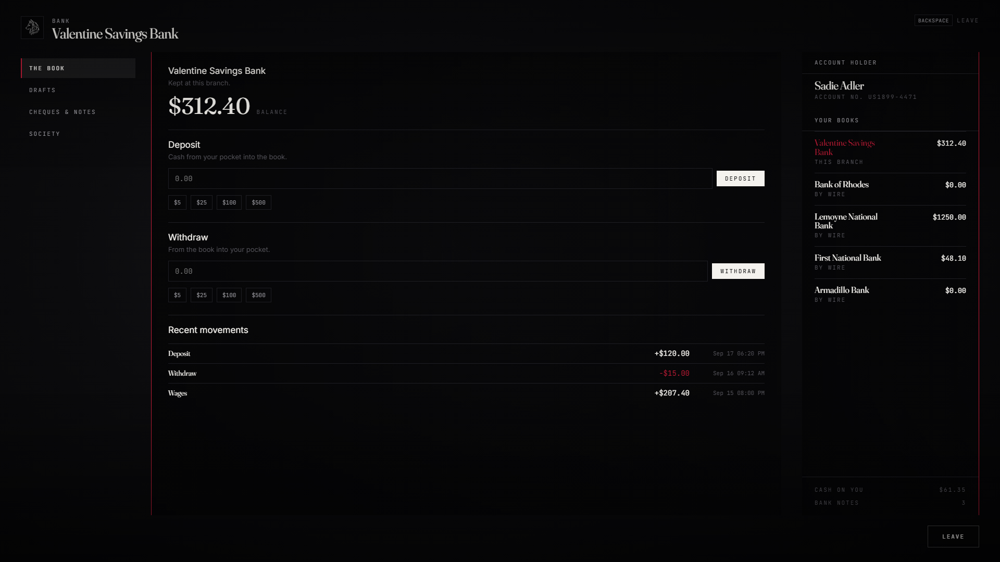

# lxr-bank — Branch books, wires, drafts and paper, for LXRCore

Banking the way 1899 did it. Money deposited in Valentine sits in Valentine:
every branch keeps its own book (one core money account per branch), and
reaching another branch's book costs a telegraph wire. Drafts move money to
an account number, here or anywhere; cheques are paper drawn on one bank
that whoever carries them cashes there; bank notes are hundred-dollar bearer
paper for sums too big for a pocket. Societies — the jobs and gangs — keep
their books here, and the core's payroll draws on them.



## What it does

* **Books** — `Config.Branches[].account` names the core account each branch
  keeps (`valbank`, `rhobank`, `bank`, …). Set them all to one account for a
  single national book. Balances stay in the core; the core ledger records
  every movement.
* **Wires** — deposit into or withdraw from another branch's book at this
  counter for `wireFeePct` (at least `wireMin`).
* **Drafts** — from this branch's book to any account number, `draftFeePct`;
  the recipient may be offline (the core's offline player object is saved).
* **Cheques** — `cheque` items with `info.amount / bank / from`, cashed only
  at the branch they are drawn on.
* **Bank notes** — `bank_note` items ($100 each) bought and redeemed at the
  counter.
* **Societies** — `lxr_bank_societies` books for every job with `society`
  in the core registry (seeded from `startBalance`) and every gang. Access
  needs the grade permission `society` or a gang boss grade. The core's
  paycheck calls `GetAccountBalance` / `RemoveMoney` here.
* **Safe deposit box** — a box per character at every branch, a fee each visit; an lxr-inventory stash only its owner opens. `Config.DepositBox`.
* **Tellers** — local peds at every counter, targets through lxr-interact;
  blips per branch; optional opening hours.
* **Themes** — LXR Night / LXR Morning from the core.

## Install

```cfg
ensure lxr-core
ensure lxr-nui
ensure lxr-inventory
ensure lxr-interact
ensure lxr-bank
```

`lxr_bank_societies` and `lxr_bank_society_ledger` are created by the core's
migration runner. The core's `Config.General.paycheck.societyResource` is
`lxr-bank`.

## Configuration

`config.lua` — `Config.Lang`, `Config.Branches`, `Config.Trade` (fees, caps,
hours, note value), `Config.Society`, `Config.Security`.

## API

| Name | Side | Purpose |
|---|---|---|
| `GetAccountBalance(_, job)` · `AddMoney(_, job, n, reason)` · `RemoveMoney(_, job, n, reason)` | server | the society contract the core's payroll uses |
| `GetBook(book)` · `MoveBook(book, delta, citizenid, reason)` | server | any society or gang book (`society_<job>`, `gang_<gang>`) |
| `lxr:bank:deposit` · `lxr:bank:withdraw` · `lxr:bank:draft` (src, branch, …) · `lxr:bank:society` (book, delta, after, citizenid, reason) | server | events |
| `Open(branchId)` · `IsOpen()` | client | open the teller from another resource |

## Licence

© 2026 iBoss21 / LXRCore — All Rights Reserved. See `LICENSE`.
